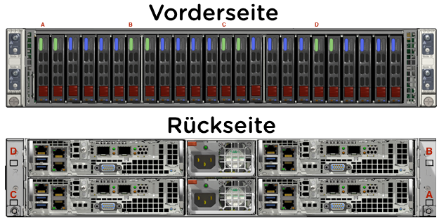

.. _clusterdetails:

------------------------
Bootcamp Cluster Details
------------------------

Cluster Hardware Details
++++++++++++++++++++++++

**Für den Hosted PoC wurden 2 Systeme mit jeweils 4 Nodes in 2 Höheneinheiten reserviert:**

.. note::
  Bedenken Sie bitte, dass diese Testumgebung zum nicht zwangsläufig  auf der neuesten Hardware basiert und das zum anderen auf Grund der Entfernung zum Lab-Datacenter entsprechende Latenzen auftreten können. Nichtsdestotrotz lassen sich mit dieser Umgebung die typischen Routineaufgaben bzgl. einer Nutanix-Cluster-Plattform mit einer ausgezeichneten User-Experience testen.

Infrastruktur IPs
+++++++++++++++++

**Cluster: NTNX-STZ-A**

.. list-table::
   :widths: 10 10 10 10
   :header-rows: 1

   * - Nodes
     - CVMs
     - Hypervisors
     - IPMI
   * - **Position A**
     - 10.38.174.29
     - 10.38.174.25
     - 10.38.174.33
   * - **Position B**
     - 10.38.174.30
     - 10.38.174.26
     - 10.38.174.34
   * - **Position C**
     - 10.38.174.31
     - 10.38.174.27
     - 10.38.174.35
   * - **Position D**
     - 10.38.174.32
     - 10.38.174.28
     - 10.38.174.36

**Cluster: NTNX-STZ-B**

.. list-table::
   :widths: 10 10 10 10
   :header-rows: 1

   * - Nodes
     - CVMs
     - Hypervisors
     - IPMI
   * - **Position A**
     - 10.38.198.29
     - 10.38.198.25
     - 10.38.198.33
   * - **Position B**
     - 10.38.198.30
     - 10.38.198.26
     - 10.38.198.34
   * - **Position C**
     - 10.38.198.31
     - 10.38.198.27
     - 10.38.198.35
   * - **Position D**
     - 10.38.198.32
     - 10.38.198.28
     - 10.38.198.36

.. list-table::
  :widths: 20 20 20
  :header-rows: 1

  * - Services
    - IP-Adressen STZ-A
    - IP-Adressen STZ-B
  * - **Cluster virtual IP**
    - 10.38.174.37
    - 10.38.198.37
  * - **iSCSI Data Services IP**
    - 10.38.174.38
    - 10.38.198.38

Zugangsdaten
++++++++++++

Die folgende Tabelle führt die standardmäßig hinterlegten Zugangsdaten für die Umgebung auf (falls andere zum Einsatz kommen sollten wird dies gesondert aufgeführt):

.. list-table::
  :widths: 20 20 10
  :header-rows: 1

  * - Name
    - Benutzername
    - Passwort
  * - **IPMI**
    - ADMIN
    - ADMIN
  * - **Prism Element**
    - admin
    - ntnx4STZ!
  * - **Prism Element VM's**
    - nutanix
    - ntnx4STZ!
  * - **Prism Central**
    - admin
    - ntnx4STZ!
  * - **Prism Central VM**
    - nutanix
    - nutanix/4u
  * - **NTNXLAB Domain**
    - NTNXLAB\\Administrator
    - nutanix/4u
  * - **CentOS VM Image**
    - root
    - nutanix/4u
  * - **Veeam VBR**
    - Veeam
    - nutanix/4u

Darüber hinaus besitzt der Cluster eine dedizierte Domain-Controller-VM, welche die Active-Directory-Services für die **NTNXLAB.local** Domain bereitstellt. Die Domain wurde mit den folgenden Nutzern und Gruppen vorkonfiguriert:

.. list-table::
  :widths: 20 20 10
  :header-rows: 1

  * - Gruppe
    - Benutzername(n)
    - Passwort
  * - **Administrators / Domain Admins**
    - Administrator
    - nutanix/4u
  * - **Bootcamp Users**
    - User01-User25
    - nutanix/4u
  * - **SSP Admins**
    - Adminuser01-Adminuser25
    - nutanix/4u
  * - **SSP Operators**
    - Operator01-Operator25
    - nutanix/4u
  * - **SSP Developers**
    - Devuser01-Devuser25
    - nutanix/4u
  * - **SSP Consumers**
    - Consumer01-Consumer25
    - nutanix/4u
  * - **SSP Custom**
    - Custom01-Custom25
    - nutanix/4u

Netzwerk
++++++++

Die folgenden virtuellen Netzwerke wurden wie folgt vorkonfiguriert:

**NTNX-STZ-A**

.. list-table::
   :widths: 33 33 33
   :header-rows: 1

   * -
     - **Primäres** Netzwerk
     - **Sekundäres** Netzwerk
   * - **VLAN**
     - 0
     - 1743
   * - **Netzwerk IP Adresse**
     - 10.38.174.0
     - 10.38.174.128
   * - **Netzmaske**
     - 255.255.255.128 (/25)
     - 255.255.255.128 (/25)
   * - **Default Gateway**
     - 10.38.174.1
     - 10.38.174.129
   * - **IP Address Management (IPAM)**
     - Aktiviert
     - Aktiviert
   * - **DHCP Pool**
     - 10.38.174.50  - 125
     - 10.38.174.132 - 253
   * - **Domain**
     - NTNXLAB.local
     - NTNXLAB.local
   * - **DNS**
     - 10.38.174.41 (DC VM)
     - 10.38.174.41 (DC VM)

**NTNX-STZ-B**

.. list-table::
   :widths: 33 33 33
   :header-rows: 1

   * -
     - **Primäres** Netzwerk
     - **Sekundäres** Netzwerk
   * - **VLAN**
     - 0
     - 1983
   * - **Netzwerk IP Adresse**
     - 10.38.198.0
     - 10.38.198.128
   * - **Netzmaske**
     - 255.255.255.128 (/25)
     - 255.255.255.128 (/25)
   * - **Default Gateway**
     - 10.38.198.1
     - 10.38.198.129
   * - **IP Address Management (IPAM)**
     - Aktiviert
     - Aktiviert
   * - **DHCP Pool**
     - 10.38.198.50  - 125
     - 10.38.198.132 - 253
   * - **Domain**
     - NTNXLAB.local
     - NTNXLAB.local
   * - **DNS**
     - 10.38.174.41 (DC VM)
     - 10.38.174.41 (DC VM)