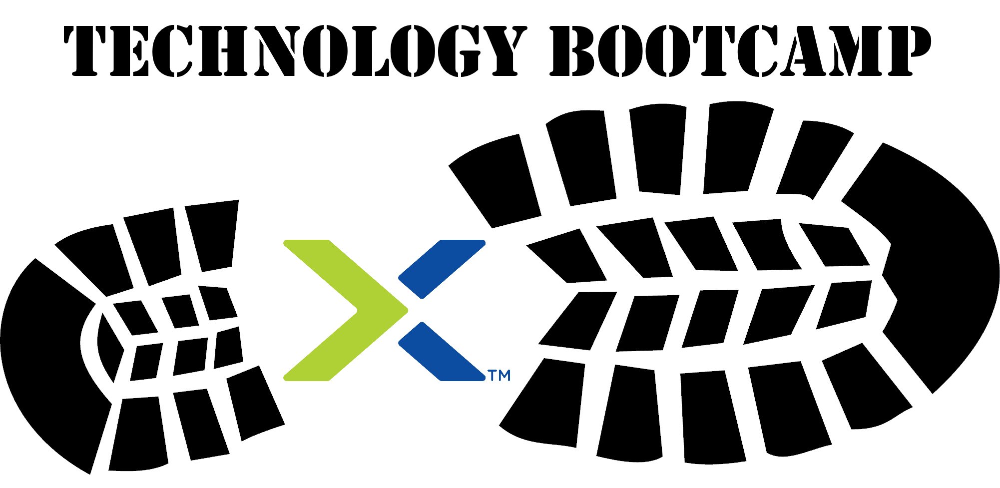

.. title:: STZ Hosted PoC

.. toctree::
   :maxdepth: 2
   :caption: Hosted PoC Infos
   :hidden:

   ansprechpartner/ansprechpartner
   clusteraccess/clusteraccess
   clusterdetails/clusterdetails
   
.. toctree::
   :maxdepth: 2
   :caption: AOS und AHV Labs
   :hidden:

   aosandahv/lab_nutanix_tech_overview/lab_nutanix_tech_overview
   aosandahv/lab_storage_configuration/lab_storage_configuration
   aosandahv/lab_network_configuration/lab_network_configuration
   aosandahv/lab_deploy_workloads/lab_deploy_workloads
   aosandahv/lab_manage_workloads/lab_manage_workloads
   aosandahv/lab_data_protection/lab_data_protection

.. toctree::
   :maxdepth: 2
   :caption: Private Cloud Labs
   :hidden:

   privatecloud/dayinlife/dayinlife
   privatecloud/prismops/prismops_capacity_lab/prismops_capacity_lab
   privatecloud/prismops/prismops_rightsize_lab/prismops_rightsize_lab
   privatecloud/files/files
   privatecloud/flow_secure_fiesta/flow_secure_fiesta

.. toctree::
   :maxdepth: 2
   :caption: Erweiterte Labs
   :hidden:

   files/files
   tools_vms/windows_tools_vm
   tools_vms/linux_tools_vm

.. _getting_started:

-----------------------------------
Herzlich willkommen auf dem Nutanix
-----------------------------------

Diese Nutanix Hosted PoC Webseite führt Sie Schritt für Schritt durch die verschiedenen Labs, sodass Sie eine umfassende praktische Einführung in die Nutanix Technologie erhalten. Als Erstes lernen Sie Prism Element kennen und werden mit dessen Funktionen und der Benutzerführung vertraut. Sie werden in diesem Lab Prism Element nutzen um Basis Cluster Administrations-Aufgaben (inkl. Storage und Netzwerk Verwaltung) sowie Basis VM-Deployments und Management-Aufgaben mit Prism und AHV durchzuführen. Weiter werden Sie VM Data Protection Optionen wie Snapshots und Replikationen sowie erweiterte Cluster Funktionalitäten mit Prism Central kennenlernen.

Der Hosted PoC  besteht primär aus zwei Hauptbestandteilen:

Teil 1: Basis Labs
  Geben Ihnen ein ersten Überblick über die Basis Routine Aufgaben / Möglichkeiten in einem Nutanix Cluster, etwa Storage, Netzwerk und Data Protection Konfiguration.

Teil 2: Erweiterte Labs
  Hier lernen Sie anhand einzelner Labs Schritt für Schritt erweiterte Nutanix Funktionalitäten kennen.

**Haben wir Ihr Interesse geweckt? Dann lassen Sie uns beginnen!**